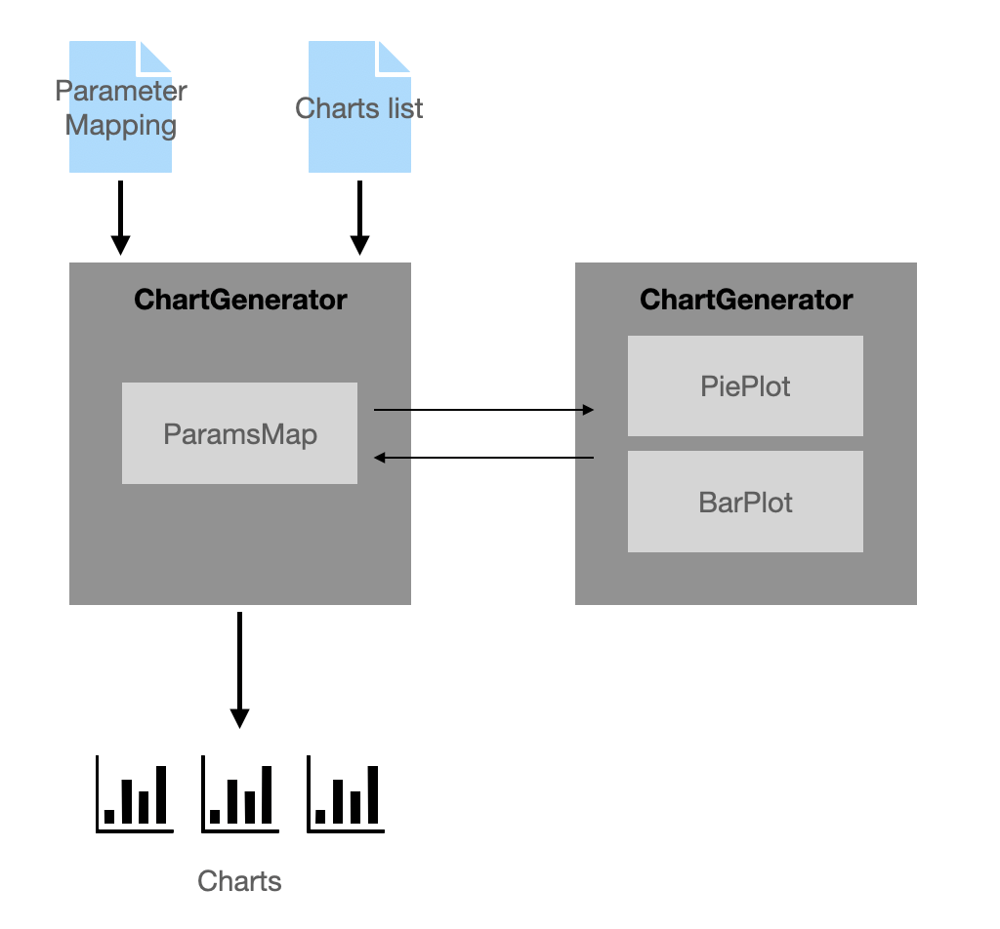

# chart-experiment

This project aims to build a dataset of charts that vary according to a range of design choices and data properties commonly displayed in data visualizations. The dataset will then be annotated, via crowdsourcing, with ratings of whether or not the chart is perceived to be readable and trustworthy. We focus on three common chart types depicting part-of-a-whole relationships. This will allow us to answer a number of research questions pertaining to chart design and visualisation guidelines for such charts. 

## Preparing Data

1. Preparing a Parameter Mapping
2. Creating data categories
3. Selecting Parameters
4. Generating a list of all desired variations

## Generating Charts



As shown on the diagram above, to generate the chart images, we need:
1. Parameter Mapping (JSON)
2. List of charts to create

## Audit

`src.tools.audit` is a script for status updates and rating progress audit. It has several options as explained below:

```bash
(base) AnetasMacBook2:chart-experiment anetaswianiewicz$ python -m src.tools.audit --help
Usage: audit.py [OPTIONS]

Options:
  -d, --file_dir TEXT             Location of csv answer exports  [required]
  --rep INTEGER RANGE             Minimum number of replications  [default:
                                  50]

  -t, --time_threshold FLOAT RANGE
                                  Answer time treshold. Answers below will be
                                  discarded.  [default: 0.1]

  -r, --report                    Gets progress report.
  -ls, --requeue_list             Outputs a txt file with charts to requeue
                                  based on supplied parameters.

  -b, --batch [1|2]               Which batch to use for the requeue list
                                  [default: 1]

  -p, --rel_params LIST           Parameters used in parsing
  --help                          Show this message and exit.
```

### Generating requeue list
```bash
(base) AnetasMacBook2:chart-experiment anetaswianiewicz$ python -m src.tools.audit -d <TARGET DIR> -ls
```
Running this will output two `txt` files (one for each task) into the working directory. The files contain all `question_id`'s below `rep` threshold. By default, the lists are given for Batch 1. Use `-ls -b 2` option to switch to Batch 2.
**NOTE:** The target directory must contain both files (without any further subdirectories) and the files must match the export naming convention (`'chart_<TASK>_<MMDD>.csv'`)