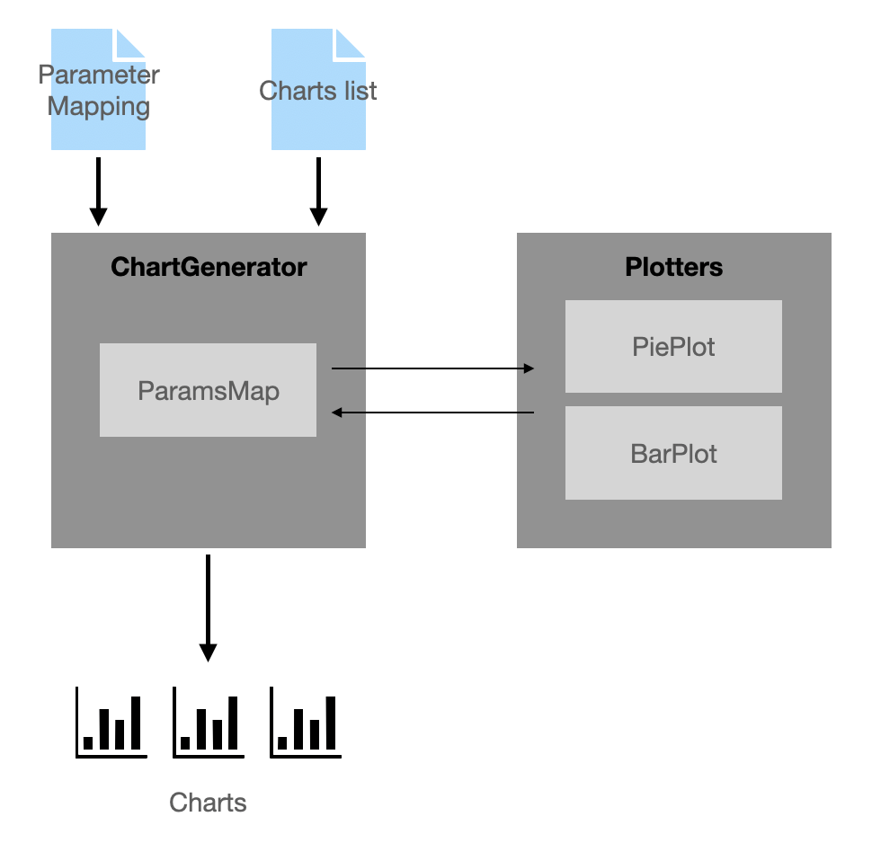

# chart-experiment

This project aims to build a dataset of charts that vary according to a range of design choices and data properties commonly displayed in data visualizations. The dataset will then be annotated, via crowdsourcing, with ratings of whether or not the chart is perceived to be readable and trustworthy. We focus on three common chart types depicting part-of-a-whole relationships. This will allow us to answer a number of research questions pertaining to chart design and visualisation guidelines for such charts. 

## Preparing Data

1. Preparing a Parameter Mapping
2. Creating data categories
3. Selecting Parameters
4. Generating a list of all desired variations

## Generating Charts

As shown on the diagram above, to generate the chart images, we need:
1. Parameter Mapping (JSON)
2. List of charts to create
